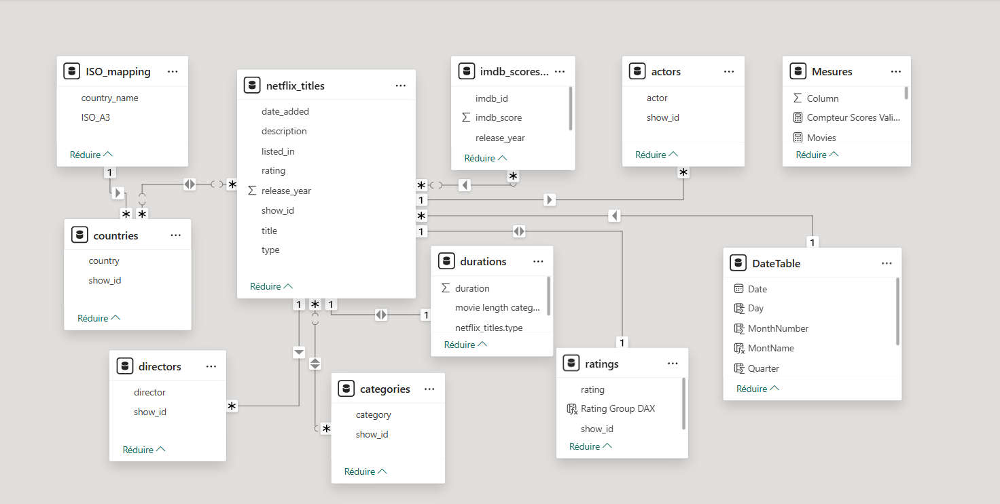
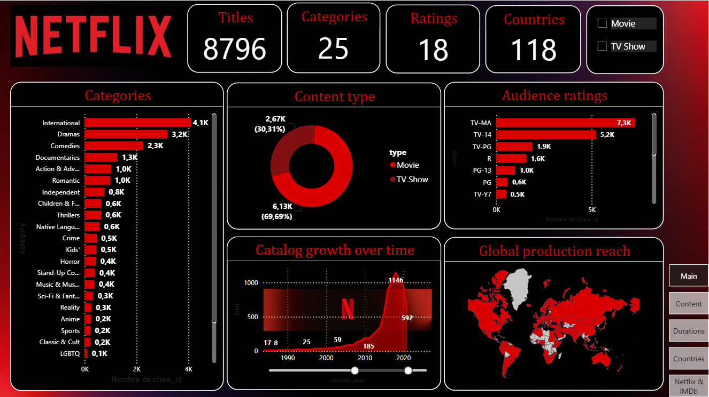
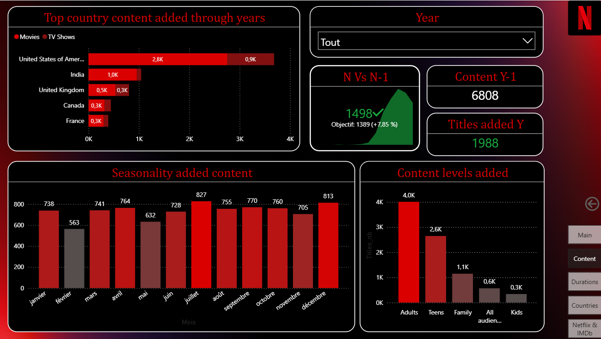
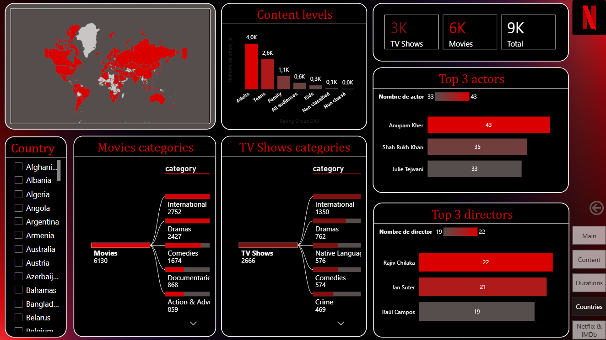
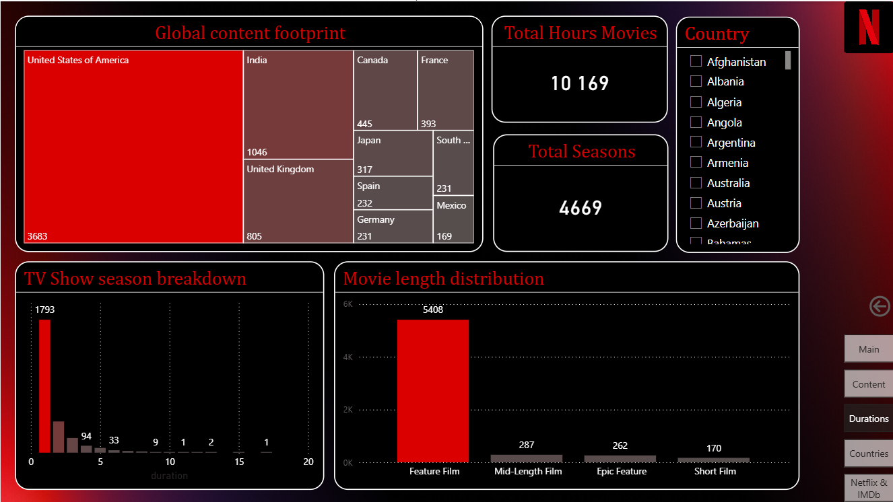
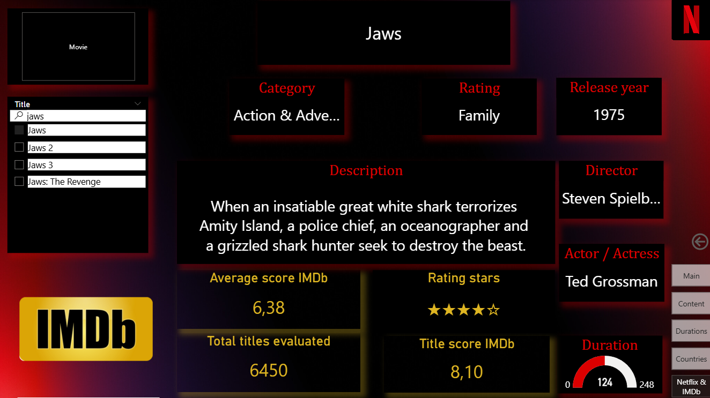

# Netflix Data Analysis – Dashboard
### Projet Data Analysis – Data Visualisation & Business Intelligence

---

## Contexte


Ce projet a été réalisé dans le cadre d’un travail personnel en **data analysis**, avec pour objectif d’explorer et de visualiser le catalogue de la plateforme **Netflix**.

Netflix est l’une des plus grandes plateformes de streaming au monde. Son succès repose sur la richesse de son catalogue, la diversité de ses contenus et leur adéquation avec les attentes des utilisateurs.  
L’analyse de ces données permet de mieux comprendre la structure du catalogue, son évolution dans le temps et sa répartition par type de contenu, genre et zone géographique.

Le projet combine **visualisation avancée sous Power BI** et **enrichissement optionnel des données via API (Python)**.

---

## Problématique

**Comment se structure le catalogue Netflix et quelles tendances peut-on observer en termes de contenus, de genres et de répartition géographique ?**

---

## Objectifs du projet

Construire un **dashboard Power BI clair, interactif et exploitable**, structurée autour de plusieurs axes :

- Analyse globale du catalogue - Chiffres clés (nombre de titres, Movies vs TV Shows)
- Répartition des contenus par genres
- Évolution du catalogue dans le temps
- Répartition géographique des productions
- Identification des pays les plus producteurs
- Analyse des acteurs, réalisateurs et durées des contenus
* Optionnel : 
- Analyse du catalogue à travers les notes IMDb

L’objectif final est de produire un **dashboard Power BI multi-pages**, permettant une exploration fluide et interactive des données.

---

## Sources des données

Les données utilisées dans ce projet proviennent de différentes sources et formats, combinant données brutes, données préparées et enrichissement manuel.

### Fichiers sources

- **netflix_titles.csv**  
  Fichier principal contenant l’ensemble des informations sur les contenus Netflix  
  (titres, type de contenu, catégories, pays, dates, durées, classifications d’âge, etc.).

- **countries_lakes.json**  
  Récupération d'un fichier Shapefiles sur le site naturalearthdata.com pour obtenir une map monde avec les frontières des différents pays. Import dans l'outil open source mapshaper.org et export du fichier json pour la future carte de forme dans Power BI
  
- **imdb_scores_export.csv**
  Fichier de sortie généré par le script Python.
  Il contient les notes récupérées via l'API OMDb, utilisées pour l'enrichissement et l'évolution future du dashboard.

Ces différentes sources permettent de couvrir l’ensemble de la chaîne analytique :  
données brutes → préparation → enrichissement via API → visualisation dans Power BI.

---

## Technologies utilisées

### Data Visualisation / BI
- Power BI

### Langage
- Python
- DAX

### Python
- python-dotenv : gestion sécurisée de la clé API

### Outils
- Visual Studio Code
- Git / GitHub
- API OMDb (optionnel, enrichissement pour de futures analyses)

### Focus API

- **API OMDb (The Movie Database)** : récupération des portraits des acteurs pour enrichissement visuel du dashboard  
- Clé API à générer sur :  https://www.omdbapi.com/
- Basic API (1€/mois) permettant 100,000 requêtes par jour
- Utilisation d’un fichier `.env` pour stocker la clé API de manière sécurisée
- Pause de sécurité dans le script 

---

## Architecture du projet

```text
NETFLIX/
|-- Data/
|   |-- netflix_titles.csv
|   |-- imdb_scores_export.csv
|
|-- API_IMDb/
|   |-- API.ipynb
|   |-- .env
|
|-- ISO_map_boundaries/
|   |-- 50m_admin_0_countries_lakes.json
|
|-- NETFLIX_Project/
|   |-- In_Netflix_Data_Analyst_Shoes.pdf
|   |-- Dashboard_model_NETFLIX.pdf
|
|-- Visualisation/
|   |-- Projet_NETFLIX_PowerBI.pbix
|
|-- README.md
|-- .gitignore
```

## Description du dashboard Power BI

## Architecture des données 

Le projet repose sur une base de données structurée selon un **modèle en étoile**

### Schéma Relationnel



## Aperçu du Projet

Voici les différentes vues du tableau de bord Netflix intégrant l'analyse des données mondiales.

### Vue Principale


Cette page propose une vision globale du catalogue NETFLIX à travers des chiffres clés. 

- Nombre total de contenus disponibles
- Repartition des Movies Vs TV Shows
- Distributions des différentes catégories
- Répartition du contenu selon la classification d'audience
- Evolution des ajouts de contenus au fil du temps
- Carte avec répartition géographique des productions

### Analyses Détaillées
| Contenu par Type | Répartition par Pays |
| :---: | :---: |
|  |  |

*Content*
- Ajout du contenu et saisonalité (création d une hiérarchie)
- Classement des pays produisant le plus de contenu
- Evolution et comparaison du contenu par rapport à l'année précédente
- Type de contenu ajouté selon la classification d'audience 

*Countries*
- Répartition des productions du pays (Movies et TV Shows) selon la catégorie
- Top acteurs les plus présents
- Top directeurs les plus productifs

| Évolution des Durées | Scores IMDB |
| :---: | :---: |
|  |  |

*Durations*
- Nombre d'heures et de saisons visionnables sur NETFLIX
- Films catégorisés selon leur durée (catégorisation utilisée aux Oscars)

*IMDb*
- Fiches techniques des Movies et TV Shows du catalogue 
- Note IMDb attribuée
- Rating stars obtenu


## Résultats clés

- Le catalogue Netflix est majoritairement composé de films, avec une forte croissance des séries au fil du temps.
- Les ajouts de contenus s’accélèrent nettement à partir des années 2010, reflétant l’expansion internationale de la plateforme.
- La production est concentrée sur quelques pays, principalement les États-Unis, avec une diversification progressive.
- Le contenu bien que très diversifié est en majorité destiné à un public adulte.
- L’analyse met en évidence une stratégie axée sur le volume, la diversité des genres et l’internationalisation.

Ce projet illustre une approche orientée visualisation et aide à la décision, centrée sur l’analyse descriptive et l’exploration interactive des données.

---

## Limites du projet

- Les données Netflix utilisées ne sont pas officielles et peuvent ne pas refléter le catalogue réel ou actuel de la plateforme.
- Le dataset ne contient pas d’informations sur l’audience, les vues ou la popularité réelle des contenus.
- L’enrichissement des données via l’API OMDb reste sujet à la disponibilité de la données 
* (contenu catalogue de 8796 titres mais seulement 6450 notés sur IMDb)

---

## Perspectives d’évolution

- Mise à jour régulière du dataset pour analyser l’évolution récente du catalogue Netflix.
- Analyses supplémentaires grâce aux notes IMDb.
* Les acteurs les plus représentés tournent ils dans des productions couronnées de succès ?
* Les réalisateurs les plus productifs sont ils les plus "bankables" ?
* Quelle catégorie obtient les meilleures scores ?
* Films récents Vs Films anciens : Les productions sont elles toujours de qualité ? 

---

## Licence

Projet réalisé à des fins pédagogiques, utilisant exclusivement des données publiques.